# <font style="color:rgb(0, 0, 0);">Vibe Coding with Oracle APEX 26.1: How APEXLang and VS Code Are Changing the Game</font>
:::info
<font style="color:rgb(0, 0, 0);">我们都听说过人工智能辅助编码，但你有没有尝试过</font>**<font style="color:rgb(0, 0, 0);">用直觉编码</font>**<font style="color:rgb(0, 0, 0);">的方式来编写 APEX 应用程序？</font>

<font style="color:rgb(0, 0, 0);">得益于 Oracle</font><font style="color:rgb(0, 0, 0);"> </font>[**<font style="color:rgb(0, 0, 0);">APEX 26.1</font>**](https://www.maxapex.com/apex-dedicated-hosting/)<font style="color:rgb(0, 0, 0);">的最新更新以及革命性的</font>**<font style="color:rgb(0, 0, 0);">APEXLang</font>**<font style="color:rgb(0, 0, 0);">格式，您不再需要手动点击数百个页面设计器菜单来进行 UI 调整或创建新报表。现在，您只需在 VS Code 中与 AI 代理聊天，让它在本地编辑您的应用程序结构，然后将其同步回云端即可。</font>

<font style="color:rgb(0, 0, 0);">让我们通过几个简单的步骤，了解如何设置这个令人惊叹的工作流程。</font>

:::


## **<font style="color:rgb(0, 0, 0);">步骤 1：将您的 Oracle APEX 应用程序导出为 APEXLang 格式</font>**
<font style="color:rgb(0, 0, 0);">首先，我们需要一个沙盒应用程序来进行测试。我们将使用一个标准的示例应用程序。</font>

+ <font style="color:rgb(0, 0, 0);">前往您的 Oracle APEX 工作区，打开 Gallery，导航至 Starter Apps，然后安装 Customers 应用。</font>

<!-- 这是一张图片，ocr 内容为： -->
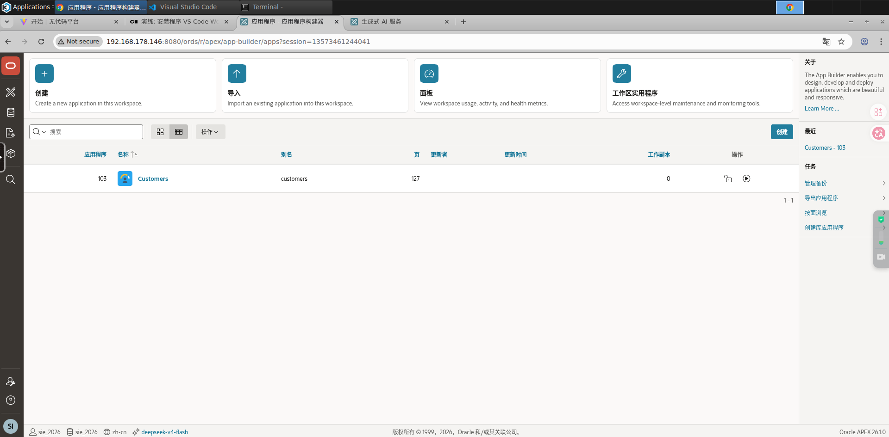

+ <font style="color:rgb(0, 0, 0);">安装完成后，打开应用构建器，点击导出/导入按钮，然后选择导出选项。</font>

<!-- 这是一张图片，ocr 内容为： -->
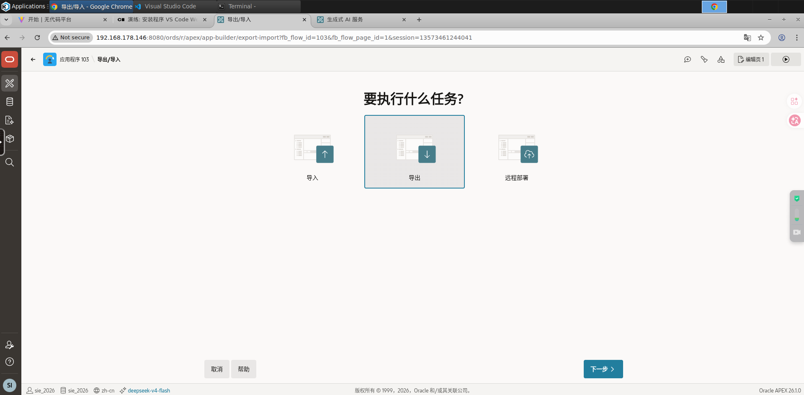

+ <font style="color:rgb(0, 0, 0);">神奇之处就在这里：不要导出传统的单个 SQL 文件，而是选择 APEXLang 作为导出格式，类型保持为“标准导出”，然后点击导出。这样就能生成一个结构清晰的 zip 文件，非常适合源代码控制和 CI/CD 流水线。</font>

<!-- 这是一张图片，ocr 内容为： -->
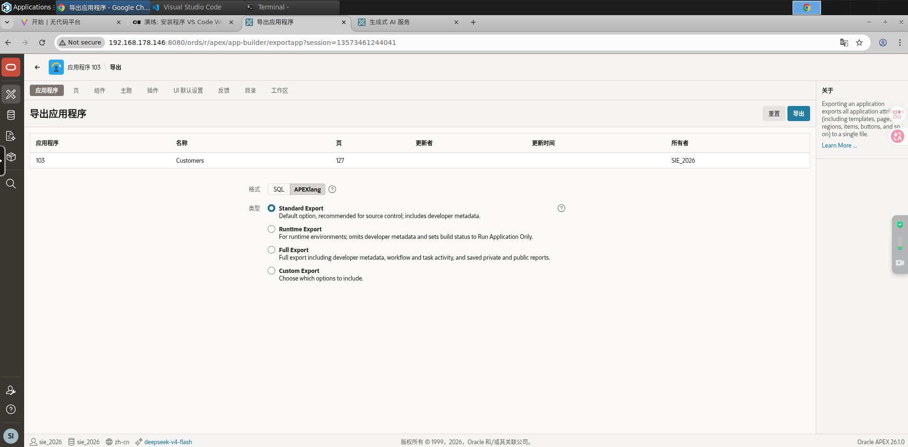

+ <font style="color:rgb(0, 0, 0);">在您的下载文件夹中找到该压缩文件并将其解压缩。</font>

<!-- 这是一张图片，ocr 内容为： -->
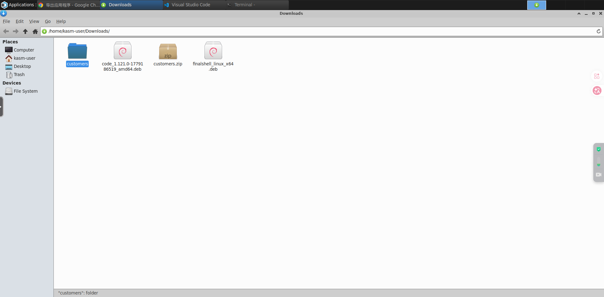

## **<font style="color:rgb(0, 0, 0);">步骤 2：设置 VS Code 以进行 Oracle APEX 开发</font>**
<font style="color:rgb(0, 0, 0);">现在，我们转到您的本地计算机。但在继续之前，请确保您已</font><font style="color:rgb(0, 0, 0);">安装并准备好使用必备的</font>**<font style="color:rgb(0, 0, 0);">VS Code</font>**<font style="color:rgb(0, 0, 0);">和</font>**<font style="color:rgb(0, 0, 0);">Node.js。</font>**

### <font style="color:rgb(15, 17, 21);">安装 Node.js</font>
```sql
# 使用 NodeSource 官方源安装最新 LTS 版本
curl -fsSL https://deb.nodesource.com/setup_20.x | sudo -E bash -
sudo apt-get install -y nodejs
```

### 安装 Oracle SQL Developer Extension for VS Code
<font style="color:rgb(0, 0, 0);">打开 VS Code，进入扩展市场，搜索</font>**<font style="color:rgb(0, 0, 0);">适用于 VS Code 的 Oracle SQL Developer 扩展。</font>**<font style="color:rgb(0, 0, 0);">还要确保它是</font>_<font style="color:rgb(0, 0, 0);">oracle.com</font>_<font style="color:rgb(0, 0, 0);">官方发布的扩展！</font>

<!-- 这是一张图片，ocr 内容为： -->
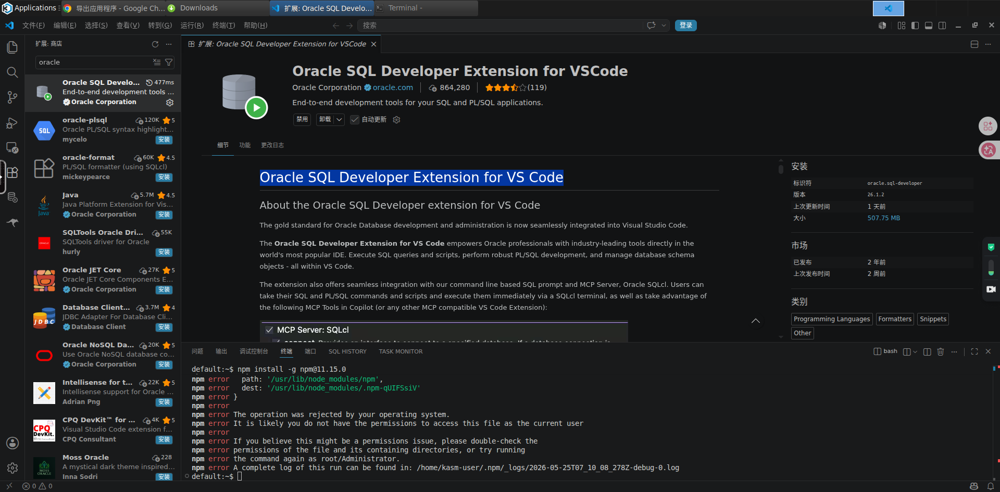

### <font style="color:rgb(0, 0, 0);">在 VS Code 中打开刚刚解压的客户应用程序文件夹。您会立即注意到，整个 APEX 应用程序已被分解为易于阅读的本地文件和文件夹（例如页面、共享组件等）。</font>
<!-- 这是一张图片，ocr 内容为： -->
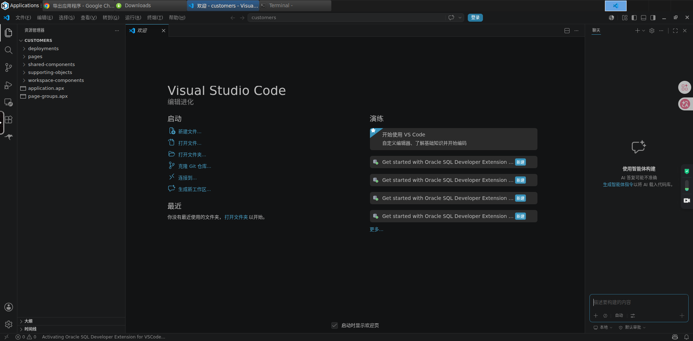

### <font style="color:rgb(0, 0, 0);">点击左侧边栏的数据库图标，点击创建连接，然后填写您的架构详细信息。测试连接以确保连接成功，保存连接并建立连接。</font>
<!-- 这是一张图片，ocr 内容为： -->
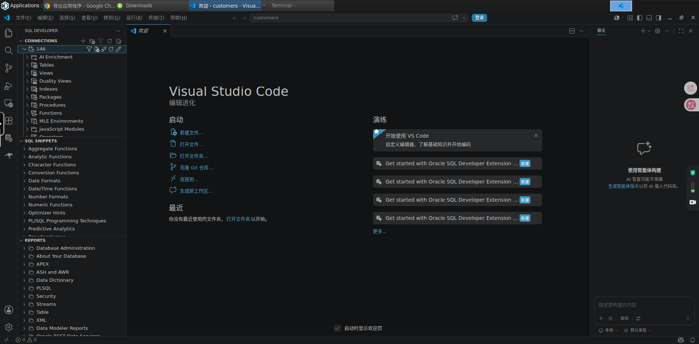

## **<font style="color:rgb(0, 0, 0);">步骤 3：添加 Oracle APEXlang 和数据库 AI 技能</font>**
<font style="color:rgb(0, 0, 0);">目前，标准的LLM（语言学习模型）本身并不理解数据库和APEXLang文件结构的复杂性。我们需要利用Oracle的官方技术，为我们的AI配备合适的工具包。</font>

<font style="color:rgb(0, 0, 0);">打开 VS Code 终端，运行以下这些极其简单的命令，即可逐一安装 APEXLang 和数据库技能：</font>

**<font style="color:rgb(0, 0, 0);">npx 技能添加 oracle/skills/apex</font>**

**<font style="color:rgb(0, 0, 0);">npx skills add oracle/skills/db</font>**

### <font style="color:rgb(0, 0, 0);">打开 VS Code 终端</font>
```sql
npx skills add oracle/skills/apex

npx skills add oracle/skills/db
```

<font style="color:rgb(0, 0, 0);">（安装过程中，只需按回车键接受默认提示即可。）</font>

<font style="color:rgb(0, 0, 0);">完成后，您将在项目目录中看到一个新的 .agents 文件夹，其中包含 APEX、APEXLang 和数据库的特定技能。您的 AI 助手已正式准备就绪，可以开始构建了！</font>

<!-- 这是一张图片，ocr 内容为： -->
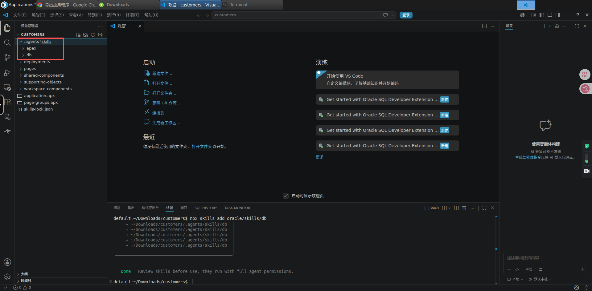

## **<font style="color:rgb(0, 0, 0);">步骤 4：使用 AI 编写你的第一个 UI 更改代码</font>**
<font style="color:rgb(0, 0, 0);">让我们来运用人工智能吧。看看你应用的默认仪表盘——它看起来很简洁，但我们想让它更亮眼一些。我们把一个容器面板的背景色改成蓝色，这样指标数据就能更醒目了。</font>

<!-- 这是一张图片，ocr 内容为： -->
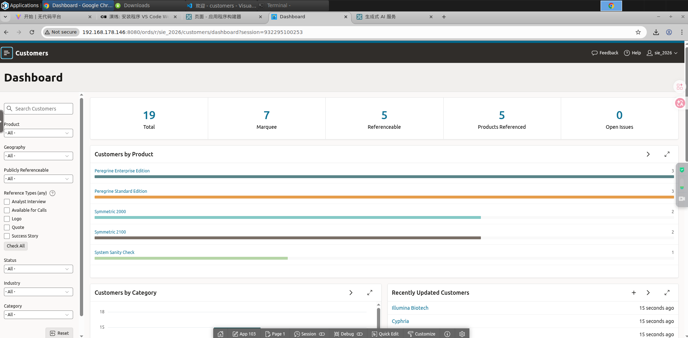

+ <font style="color:rgb(0, 0, 0);">打开 VS Code AI 聊天面板。</font>
+ <font style="color:rgb(0, 0, 0);">添加一个简单的提示：</font>

```sql
“将仪表盘页面的背景颜色更改为蓝色”
```

<!-- 这是一张图片，ocr 内容为： -->
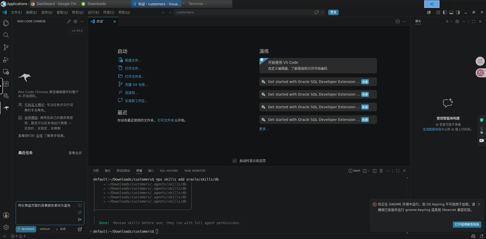

+ <font style="color:rgb(0, 0, 0);">观看 AI 立即扫描您的文件，精确定位 p00001-dashboard.apx，并将内联 CSS 调整直接应用到 APEXLang 结构中。</font>
+ <font style="color:rgb(0, 0, 0);">准备好查看实时效果了吗？点击编辑器右上角的绿色“导入/同步”按钮。该扩展程序会将修改立即推送回您的 Oracle APEX 云工作区。</font>

<!-- 这是一张图片，ocr 内容为： -->
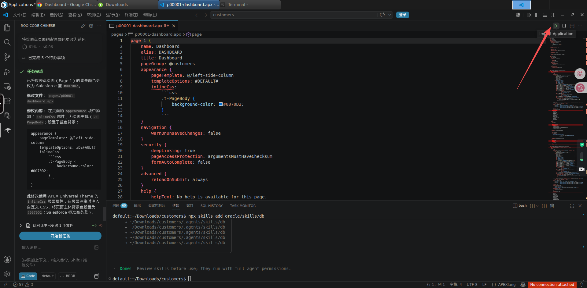

<!-- 这是一张图片，ocr 内容为： -->
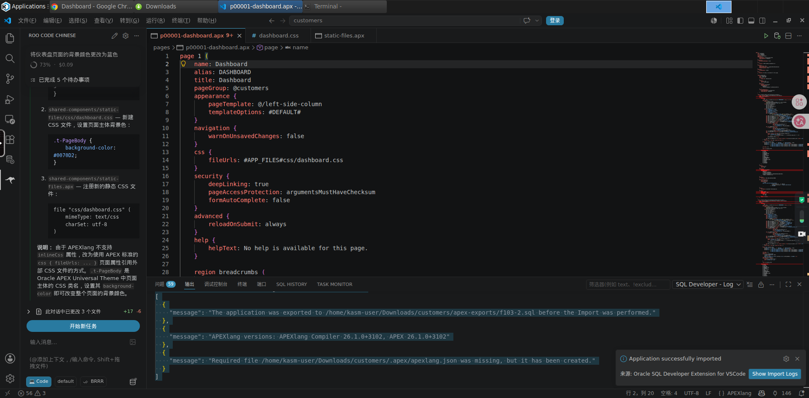

效果：

<!-- 这是一张图片，ocr 内容为： -->
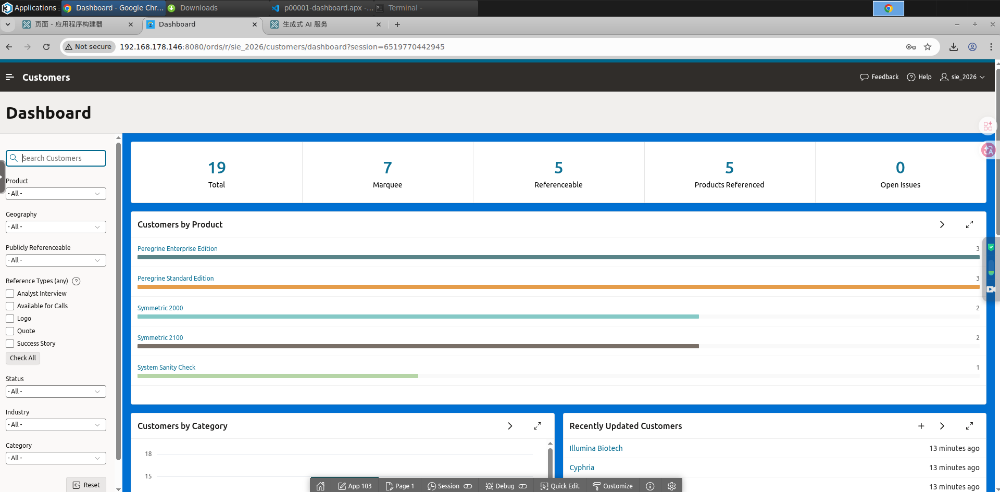

## **<font style="color:rgb(0, 0, 0);">步骤 5：通过单个 AI 提示生成整个 APEX 页面</font>**
<font style="color:rgb(0, 0, 0);">改变颜色很酷，但如何构建实际功能呢？让我们让人工智能创建一个全新的数据视图。</font>

<font style="color:rgb(0, 0, 0);">在 AI 聊天中，向其发送一个更复杂的提示：</font>

```sql
创建一个名为“产品详情”的新页面，并使用产品页面上的数据生成交互式报告。
```

<!-- 这是一张图片，ocr 内容为： -->
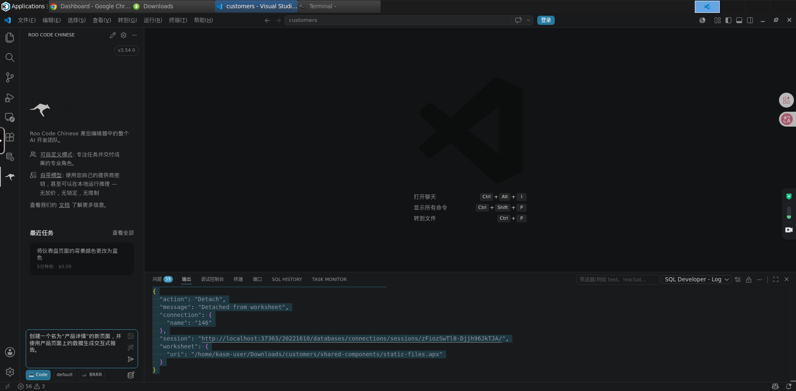

<font style="color:rgb(0, 0, 0);">几秒钟之内，人工智能就能从零开始编写一个全新的 .apx 页面配置，规划出一个交互式报表区域，将其连接到底层数据字典，并进行无缝链接。再次点击同步按钮，即可获得一个功能齐全、数据连接的页面，用于处理数据录入和产品跟踪。</font>

<font style="color:rgb(0, 0, 0);"></font>

<!-- 这是一张图片，ocr 内容为： -->
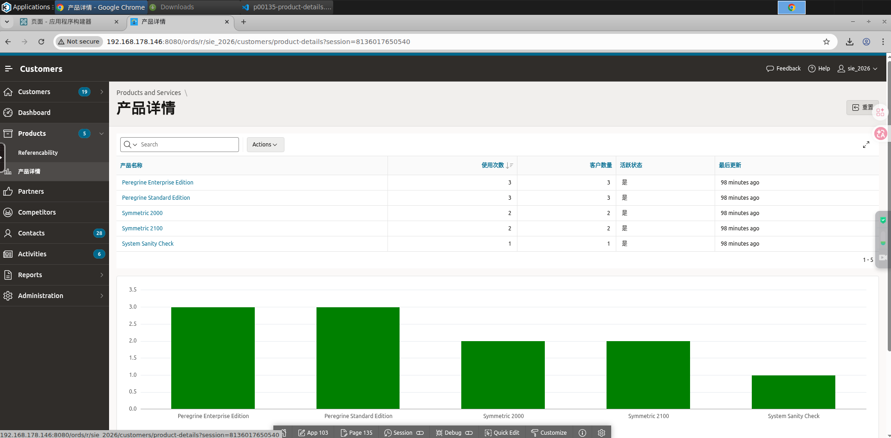

<font style="color:rgb(0, 0, 0);"></font>

<font style="color:rgb(0, 0, 0);"></font>

## <font style="color:rgb(0, 0, 0);">参考文章</font>
[https://www.maxapex.com/blogs/vibe-coding-oracle-apex-26-1-apexlang-vscode/](https://www.maxapex.com/blogs/vibe-coding-oracle-apex-26-1-apexlang-vscode/)

<font style="color:rgb(0, 0, 0);"></font>

