# 基于 Frp 与 Cloudflare 的内网穿透与 HTTPS 安全访问方案 {#frp-all}

::: tip 告别端口号，优雅发布内网服务
还在为没有公网IP或访问服务时要输入繁琐的“IP:端口”而烦恼吗？本方案将指导你结合Frp的内网穿透能力与Cloudflare的全球网络，利用自有域名搭建一条安全、便捷的访问通道。你将彻底告别端口号，通过自定义域名（如 blog.yourdomain.com）直接访问内网服务，并自动获得HTTPS加密，让远程访问变得既美观又安全。
:::

# 整体流程图 {#frp-1}
- 画图工具推荐 ： [ai-smart-draw](https://ai-smart-draw.vercel.app/)
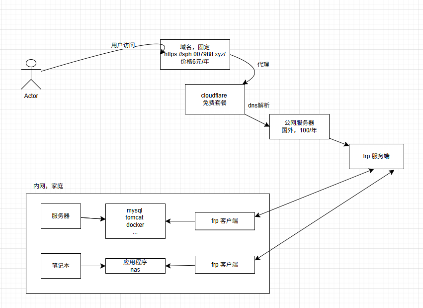

# 部署操作 {#frp-2}
首先你得准备：
- 主机
    - 这里尽量购买国外的服务器，可以免备案，举例用：[AkileCloud](https://akile.ai/)
    - 也可以用我这个推荐的连接：[host](https://www.007988.xyz/deploy/#host)
    - 这里我用的是AkileCloud，价格便宜，还可以魔法上网。
      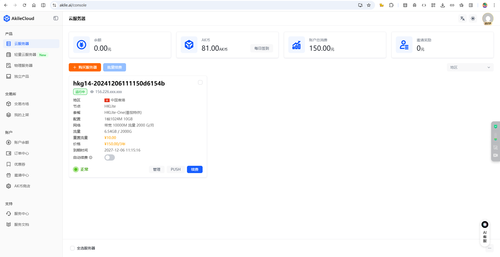
- [spaceship](https://www.spaceship.com)
    - 6位数字域名 US$0.67/年 -- ( *.xyz )
        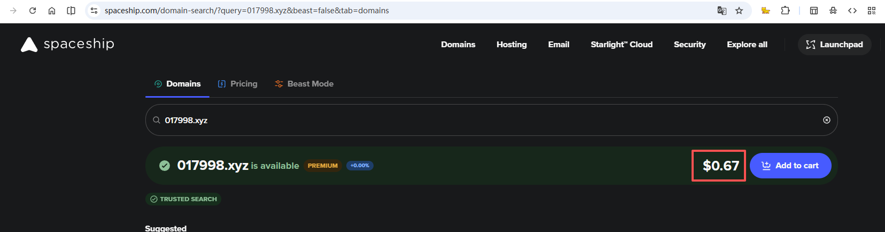
    - 支持支付宝支付，预计6元一年
        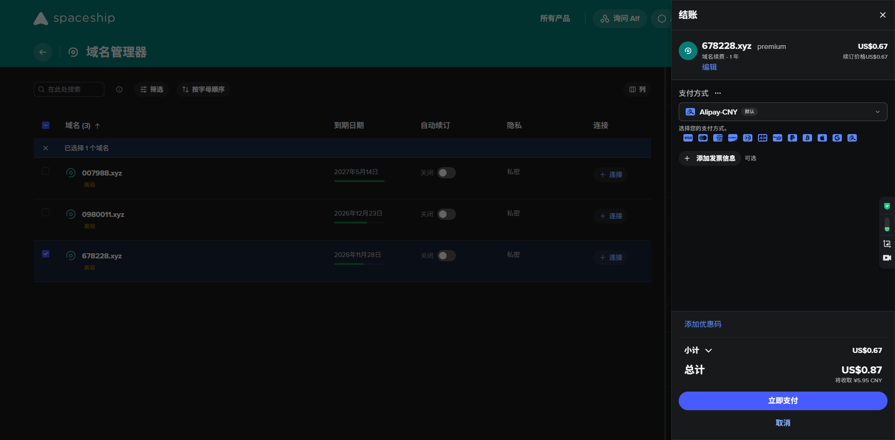
    - 更改一下dns，指向到 Cloudflare
        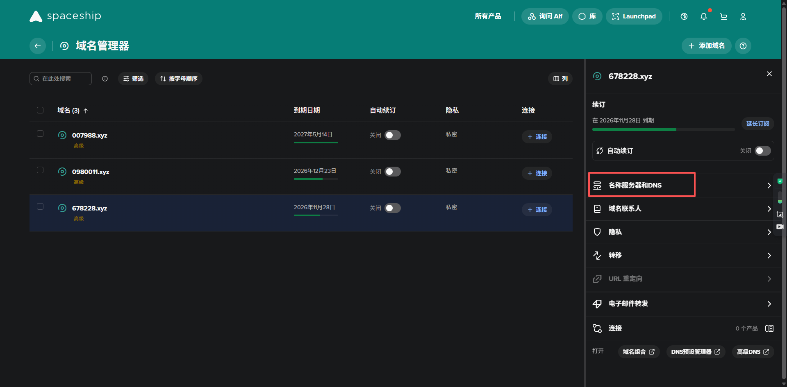
        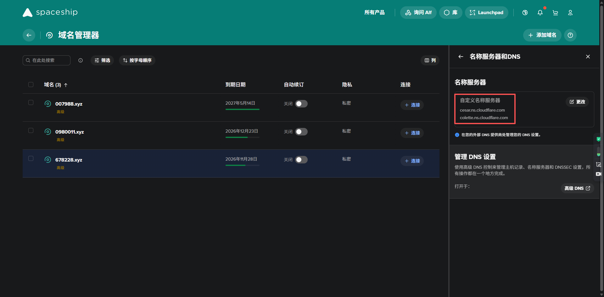
- [Cloudflare](https://dash.cloudflare.com)
    - 添加域名管理，把刚刚的域名转入到Cloudflare，选择free套餐
        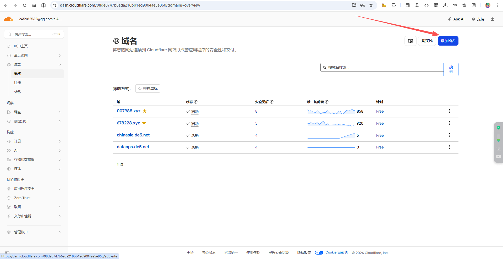
    - 添加到你的主机IP，选择* 可以支持泛域名
        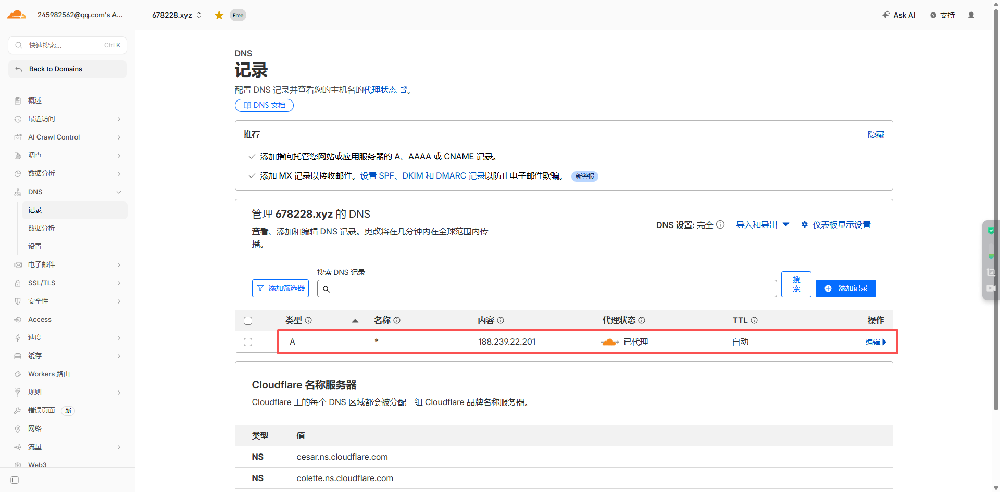
    - 添加证书，自动管理，自动续约
        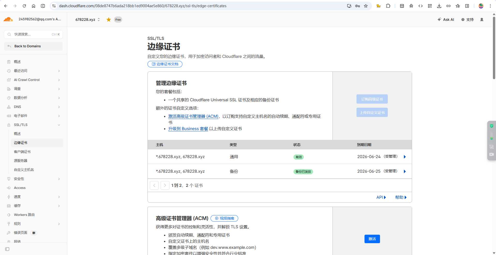
- [frp](https://github.com/fatedier/frp)
    - [frp](https://github.com/fatedier/frp) 下载
        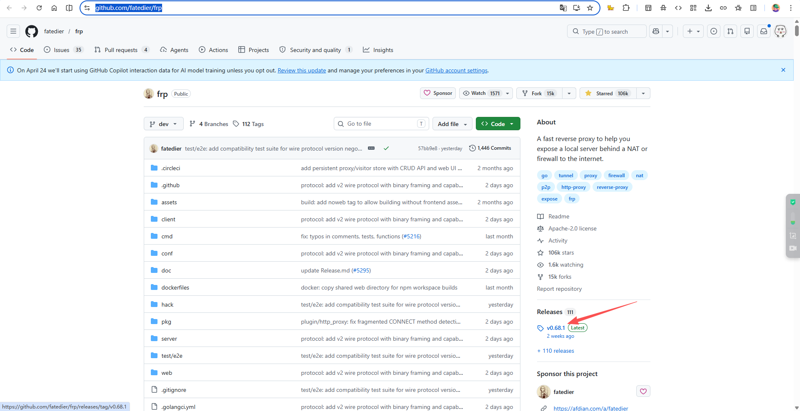
    - 服务端部署，比如我是linux的，按照官方文档部署
        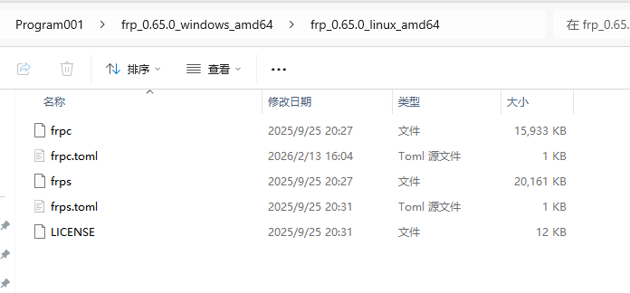
    - 修改 frps.toml，配置如下：
        ```bash
        bindPort = 7000
        webServer.addr = "0.0.0.0"
        webServer.port = 7500
        webServer.user = "admin"
        webServer.password = "password"

        auth.token = "token"
      
        vhostHTTPPort = 80
        vhostHTTPSPort = 443
        subdomainHost = "678228.xyz"
        ```
    - 在主机上启动服务端
        ```bash
        nohup ./frps -c frps.toml > frps.log 2>&1 &
        ``` 
    - 启动完成，访问 http://ip:7500/ 可以看到服务端管理页面
    - 输入账号密码，登录，可以查看目前代理的列表
        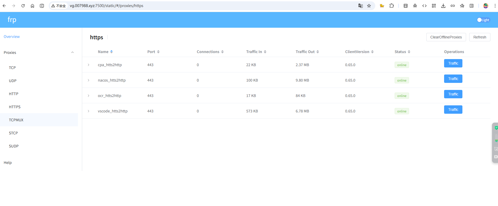
- frp客户端配置
    - frpc.toml，我的配置如下，那后面你的公网访问地址就是：http://sph.678228.xyz，就可以把你本地 127.0.0.1:5000 的服务代理到你的主机，然后访问 http://sph.678228.xyz 就可以访问你的服务了
        ```bash
        serverAddr = "ip" #你的主机公网ip
        serverPort = 7000
        auth.token = "token"

        [[proxies]]
        name = "sph_htts2http"
        type = "https"
        subdomain = "sph"

        [proxies.plugin]
        type = "https2http"
        localAddr = "127.0.0.1:5000"
        hostHeaderRewrite = "127.0.0.1"
        requestHeaders.set.x-from-where = "frp"
        ``` 
    - 新建一个 frpc.bat 文件，内容如下：
        ```bash
        @echo off
        chcp 65001 >nul
        echo 正在启动 FRPC 客户端...
        frpc.exe -c frpc.toml
        pause
        ``` 
