# 魔法上网 {#deploying-a-static-site}

首先你得安装魔法工具：

- Karing
    - Karing目前提供了Windows、MacOS、Android、IOS和TVOS，5种客户端的支持，各位可以根据需要下载适合自己的客户端
    - 官网：https://karing.app
    - Github：https://github.com/KaringX/karing
- Clash Party
    - 自行Google 或 github
- v2rayN
    - 自行Google 或 github
- ...

::: tip 注意
假设你已经有魔法工具了。
:::

## 方式一 {#building-the-app}

先去获取一个订阅，什么要钱？ 不，当然要白嫖了。

fofa:[地址](https://fofa.info/)

```bash
body="port: 7890" && body="socks-port: 7891" && body="allow-lan: true"
```
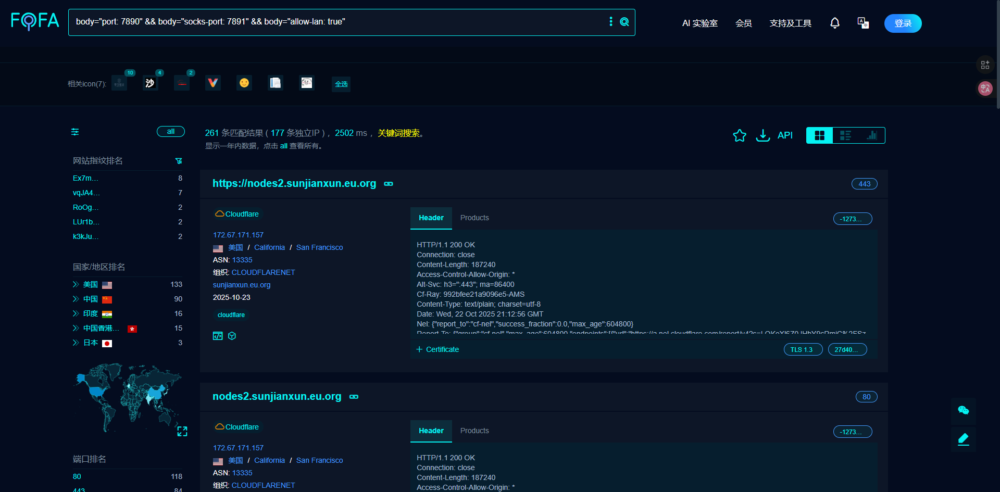

### 导入工具测试 {#testing-the-app-locally}

然后随便打开一个链接，如果是下方类似内容，就导入工具测试
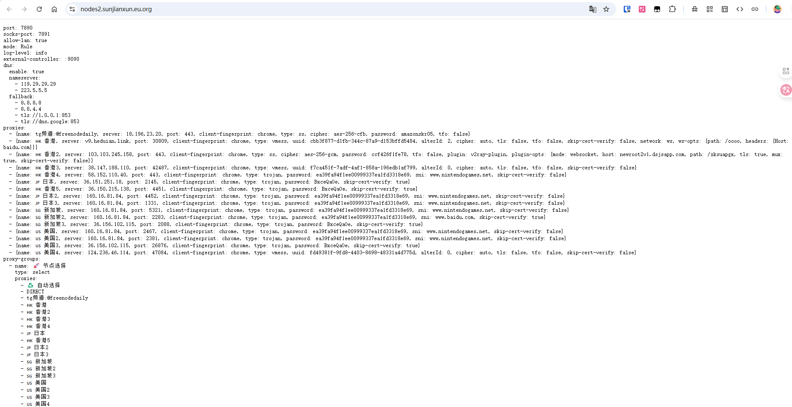

## 方式二 {#building-the-app2}
直接用大佬的🔥🔥🔥共享订阅

https://github.com/wzdnzd/aggregator/issues/91

## 方式三 {#building-the-app3}
主要分享一下最新的基于Github Action使用方法。

流程如下：

1. fork作者的代码仓库：https://github.com/wzdnzd/aggregator

2. 启用Actions，如下图：
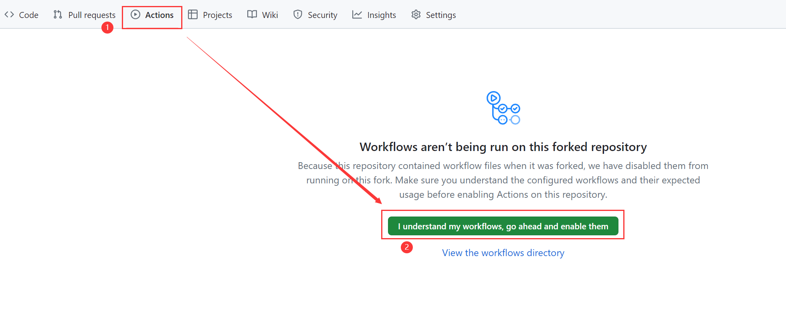
3. 禁用不必要的workflow，比如Checkin和Process，具体操作如下：
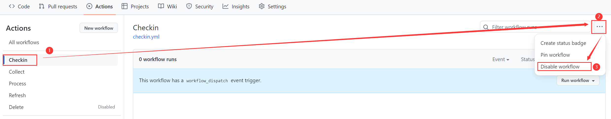
4. 创建gist并获取到username/gist_id（记得保存，稍后要用），打开 https://gist.github.com，随便创建一个，内容随便填，如图所示
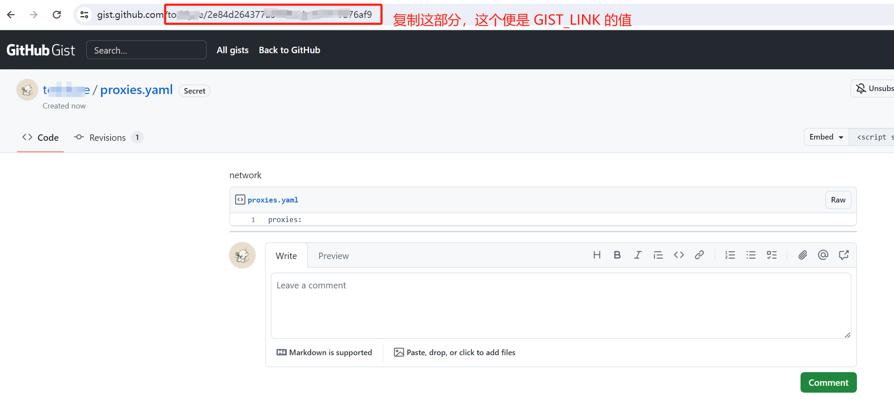
5. 回到 https://github.com/settings/personal-access-tokens 点击Generate new token按钮创建 PAT。名字随便填，过期时间选得久一点，重要的是在Account permissions里授予Gists的读写权限，创建好后复制生成的token稍后用
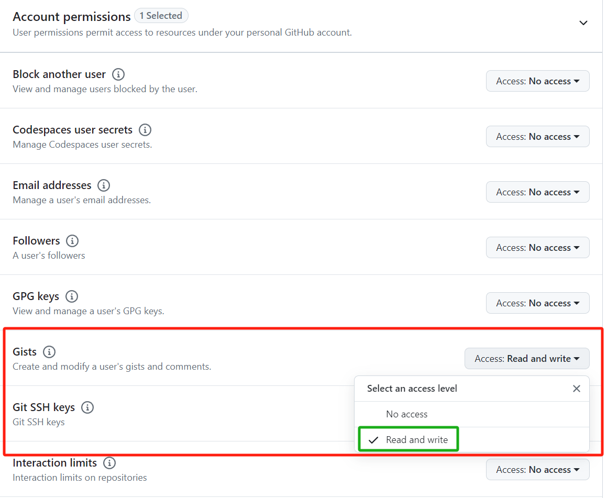
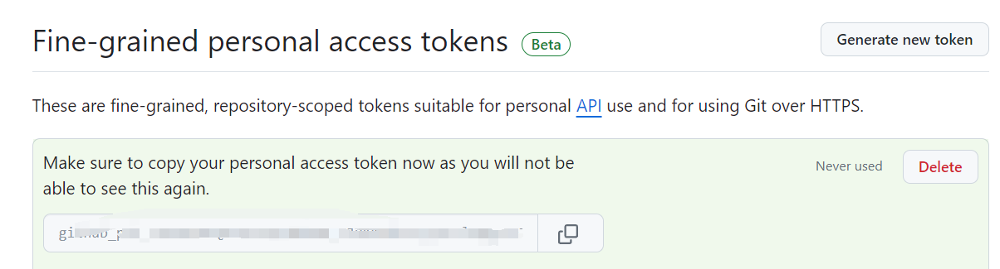
6. 到仓库页面的Settings里设置环境变量，变量名为GIST_LINK和GIST_PAT，值分别为第4和5两步获取到的内容
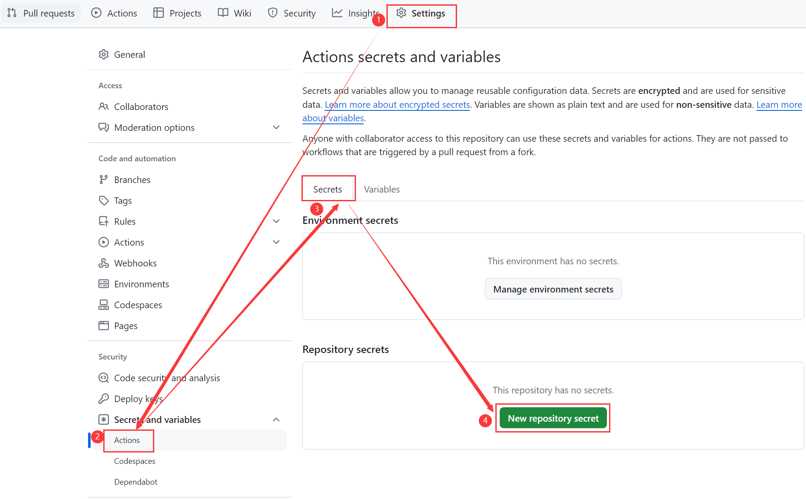
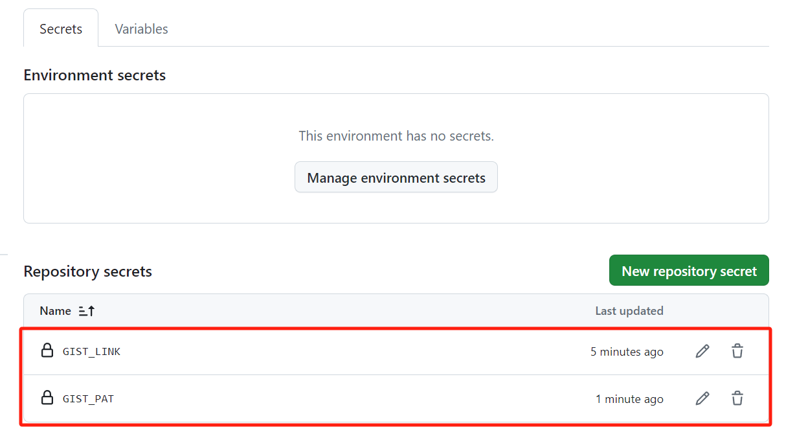
7. 手动运行测试是否能够正常执行并成功推送到gist
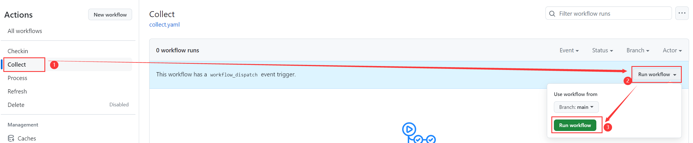
   如果你看到类似以下内容，说明你跑成功了（也可以到刚刚新建的gist里查看内容）
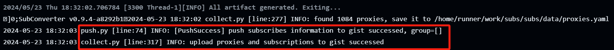
8. 添加订阅到你的翻墙软件里，添加不了的可以先订阅转换一下
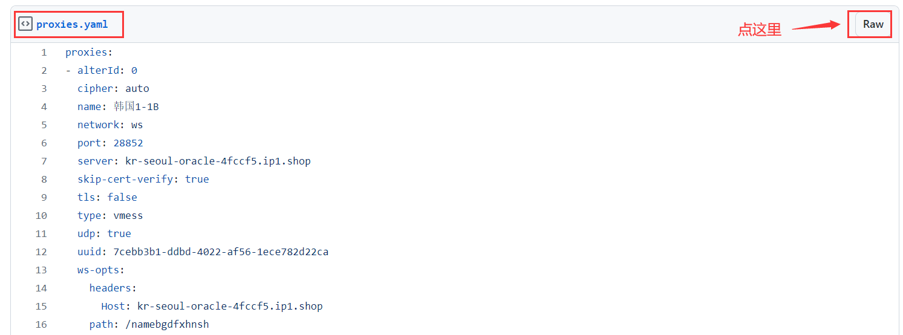
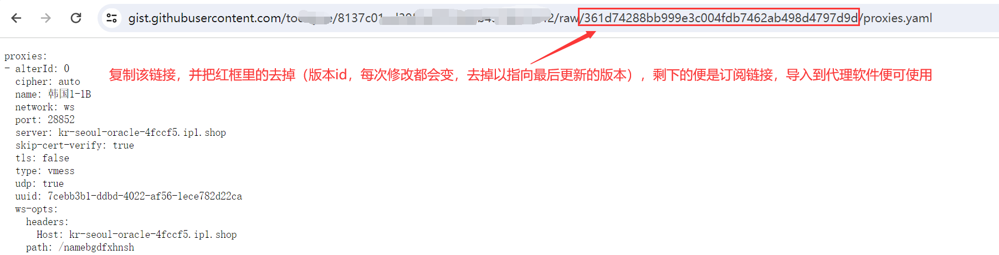
9. 小建议：
   - 可以配合Watchingfun大佬的 [自用clash verge的 js脚本配置分享](https://linux.do/t/topic/89820) 使用
   - 如果你也在用，可以去给项目作者点个star，更新挺频繁，也很贴心
   - 启用Action后如果中途你不想搞了，一定要禁用workflow或Action，因为默认每两小时自动执行一次